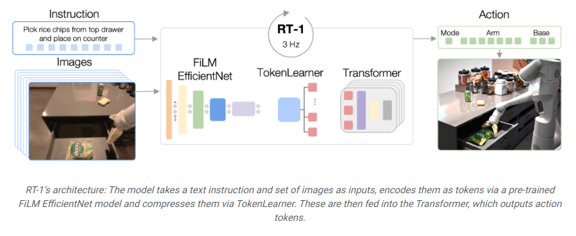
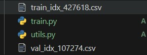
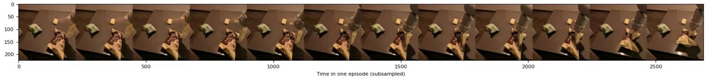

</img>

## RT1_pytorch_training

The whole training code of <a href="https://ai.googleblog.com/2022/12/rt-1-robotics-transformer-for-real.html">RT1 (Robotic Transformer)</a>, from the Robotics at Google team, in Pytorch

## Data

### Get RT1 dataset

```
gsutil cp -R "gs://gresearch/robotics/fractal20220817_data/0.1.0" destination-directory
```

### Dataset segment

考虑到磁盘大小 (目前我的磁盘大小仅1T)，整体预处理后的数据应该是5T左右。还有为了保证后续dataloader流畅地读取数据将数据处理成一段一段的.h5文件


```bash
conda activate rt-tf
# env rt-tf ref: env/rt-tf_requirements.txt

python data_preprocessing/rt_data_generator_all.py


episode section length
# episode_sec_len = 20   

# The memory size of 100 个 episode:6.12 G
# The memory size of 20 个 episode:1.2 G
```

批量生成 *episode_sec_len* 个episode的.h5文件 

</img>

if any question of rt-tf env  ref: https://colab.research.google.com/github/google-deepmind/open_x_embodiment/blob/main/colabs/Open_X_Embodiment_Datasets.ipynb


```
run rt_data_generator_pick_batch.py
```

批量生成 *episode_sec_len* 个episode的.h5文件(只需要pick object的任务)

### DataPreprocess

```bash
conda activate rt
# env rt ref: env/rt_requirements.txt

python DataPreprocess_batch_all.py

# run DataPreprocess_batch_pick.py   # only pick object task
```

实现数据预处理，具体预处理操作细节后续更新或者自行阅读源码

</img>


### Generate data index for dataloader

```
python data_emerge.py
```

you will Get two .csv file

</img>


chang the *filepath_or_buffer* and *self.size* of train and val.


</img>


## Training

单节点4卡V100训练(如果你的GPU设备不一致请自行修改 *batch_size* 和 *learning_rate* 大小, 但请保持同步改变)：

```
python -m torch.distributed.launch --nproc_per_node=4 --use_env train_ddp.py

# pkill -9 python 异常停止时，杀死进程并释放GPU显存
```

</img>


开始训练，一个epoch大约需要4个小时


------

**展示 *pick brown chip bag*  任务**

</img>

放大(展示某=每个trajectory即6隔帧取一次图片)：

</img>

图中预测值(橘色)与基线值(蓝色)基本一致。

</img>


## 展望

给 LLaVA-34b一张截图，展示其惊人的图片理解能力。后期需要结合RT系列与LLaVA.  预想为RT-LLaVA

</img>

## Appreciation

- <a href="https://stability.ai/">Stability.ai</a> for the generous sponsorship to work and open source cutting edge artificial intelligence research.
- https://github.com/lucidrains/robotic-transformer-pytorch for RT1model(pytorch).
- https://github.com/google-deepmind/open_x_embodiment for dataset process.

## Citations

```bibtex
@inproceedings{rt12022arxiv,
    title    = {RT-1: Robotics Transformer for Real-World Control at Scale},
    author   = {Anthony Brohan and Noah Brown and Justice Carbajal and  Yevgen Chebotar and Joseph Dabis and Chelsea Finn and Keerthana Gopalakrishnan and Karol Hausman and Alex Herzog and Jasmine Hsu and Julian Ibarz and Brian Ichter and Alex Irpan and Tomas Jackson and  Sally Jesmonth and Nikhil Joshi and Ryan Julian and Dmitry Kalashnikov and Yuheng Kuang and Isabel Leal and Kuang-Huei Lee and  Sergey Levine and Yao Lu and Utsav Malla and Deeksha Manjunath and  Igor Mordatch and Ofir Nachum and Carolina Parada and Jodilyn Peralta and Emily Perez and Karl Pertsch and Jornell Quiambao and  Kanishka Rao and Michael Ryoo and Grecia Salazar and Pannag Sanketi and Kevin Sayed and Jaspiar Singh and Sumedh Sontakke and Austin Stone and Clayton Tan and Huong Tran and Vincent Vanhoucke and Steve Vega and Quan Vuong and Fei Xia and Ted Xiao and Peng Xu and Sichun Xu and Tianhe Yu and Brianna Zitkovich},
    booktitle = {arXiv preprint arXiv:2204.01691},
    year      = {2022}
}
```

```bibtex
@inproceedings{Tu2022MaxViTMV,
    title   = {MaxViT: Multi-Axis Vision Transformer},
    author  = {Zhengzhong Tu and Hossein Talebi and Han Zhang and Feng Yang and Peyman Milanfar and Alan Conrad Bovik and Yinxiao Li},
    year    = {2022}
}
```

```bibtex
@misc{peebles2022scalable,
    title   = {Scalable Diffusion Models with Transformers},
    author  = {William Peebles and Saining Xie},
    year    = {2022},
    eprint  = {2212.09748},
    archivePrefix = {arXiv},
    primaryClass = {cs.CV}
}
```
