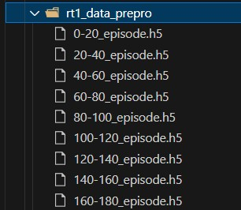

</img>

## RT1_pytorch_training

The whole training code of <a href="https://ai.googleblog.com/2022/12/rt-1-robotics-transformer-for-real.html">RT1 (Robotic Transformer)</a>, from the Robotics at Google team, in Pytorch

## Data

### Get RT1 dataset

```
gsutil cp -R "gs://gresearch/robotics/fractal20220817_data/0.1.0" destination-directory
```

### Dataset segment

Considering the disk size (currently my disk size is only 1T), the overall preprocessed data should be about 5T. And in order to ensure that the subsequent dataloader smoothly read the data will be processed into a section of the .h5 file

```bash
conda activate rt-tf
# env rt-tf ref: rt-tf_requirements.txt

python data_preprocessing/rt_data_generator_all.py


episode section length
# episode_sec_len = 20   

# The memory size of 100 个 episode:6.12 G
# The memory size of 20 个 episode:1.2 G
```

Batch generate .h5 files for *episode_sec_len* episodes 

</img>

if any question of rt-tf env  ref: https://colab.research.google.com/github/google-deepmind/open_x_embodiment/blob/main/colabs/Open_X_Embodiment_Datasets.ipynb

```
run rt_data_generator_pick_batch.py
```

Batch generate *episode_sec_len* .h5 files of episodes (pick object only task)

### DataPreprocess

```bash
conda activate rt
# env rt ref: rt_requirements.txt

python DataPreprocess_batch_all.py

# run DataPreprocess_batch_pick.py   # only pick object task
```

To realize the data preprocessing, specific preprocessing operation details of the subsequent update or read the source code themselves.


</img>


### Generate data index for dataloader

```
python data_emerge.py
```

you will Get two .csv file

</img>

chang the *filepath_or_buffer* and *self.size* of train and val.

</img>


## Training

Single node 4-card V100 training (please modify *batch_size* and *learning_rate* sizes yourself if your GPU devices are inconsistent, but keep the changes synchronized):

```bash
python -m torch.distributed.launch --nproc_per_node=4 --use_env train_ddp.py

pkill -9 python   # Kills the process and frees the GPU memory when stopped abnormally
```

</img>

Start training, one epoch takes about 4 hours

------

*pick brown chip bag Task*

</img>

Zoom in (show a certain trajectory i.e. take the picture every 6 frames):

</img>

The predicted values (orange) in the graph are generally consistent with the baseline values (blue).

</img>


## Foresight

Give LLaVA-34b a screenshot to show its amazing picture comprehension. The later needs to combine the RT series with LLaVA. envisioned as RT-LLaVA.

</img>

## Appreciation

- <a href="https://stability.ai/">Stability.ai</a> for the generous sponsorship to work and open source cutting edge artificial intelligence research.
- https://github.com/lucidrains/robotic-transformer-pytorch for RT1model(pytorch).
- https://github.com/google-deepmind/open_x_embodiment for dataset process.

## Citations

```bibtex
@inproceedings{rt12022arxiv,
    title    = {RT-1: Robotics Transformer for Real-World Control at Scale},
    author   = {Anthony Brohan and Noah Brown and Justice Carbajal and  Yevgen Chebotar and Joseph Dabis and Chelsea Finn and Keerthana Gopalakrishnan and Karol Hausman and Alex Herzog and Jasmine Hsu and Julian Ibarz and Brian Ichter and Alex Irpan and Tomas Jackson and  Sally Jesmonth and Nikhil Joshi and Ryan Julian and Dmitry Kalashnikov and Yuheng Kuang and Isabel Leal and Kuang-Huei Lee and  Sergey Levine and Yao Lu and Utsav Malla and Deeksha Manjunath and  Igor Mordatch and Ofir Nachum and Carolina Parada and Jodilyn Peralta and Emily Perez and Karl Pertsch and Jornell Quiambao and  Kanishka Rao and Michael Ryoo and Grecia Salazar and Pannag Sanketi and Kevin Sayed and Jaspiar Singh and Sumedh Sontakke and Austin Stone and Clayton Tan and Huong Tran and Vincent Vanhoucke and Steve Vega and Quan Vuong and Fei Xia and Ted Xiao and Peng Xu and Sichun Xu and Tianhe Yu and Brianna Zitkovich},
    booktitle = {arXiv preprint arXiv:2204.01691},
    year      = {2022}
}
```

```bibtex
@inproceedings{Tu2022MaxViTMV,
    title   = {MaxViT: Multi-Axis Vision Transformer},
    author  = {Zhengzhong Tu and Hossein Talebi and Han Zhang and Feng Yang and Peyman Milanfar and Alan Conrad Bovik and Yinxiao Li},
    year    = {2022}
}
```

```bibtex
@misc{peebles2022scalable,
    title   = {Scalable Diffusion Models with Transformers},
    author  = {William Peebles and Saining Xie},
    year    = {2022},
    eprint  = {2212.09748},
    archivePrefix = {arXiv},
    primaryClass = {cs.CV}
}
```
